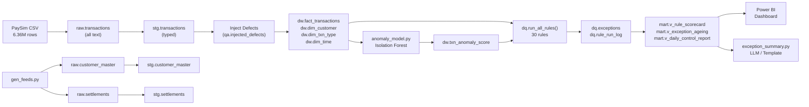

# Bank Transaction Data Quality & Anomaly Intelligence Platform

> **⚠️ SYNTHETIC DATA NOTICE**: This project uses **PaySim** (Kaggle), a synthetic dataset simulating mobile money transactions. All data, defects, and anomalies are either synthetic or deliberately injected for demonstration purposes. No real customer or financial data is used.

[](https://github.com/aryanimbalkar03-lab/Bank-anamoly-detection/actions/workflows/ci.yml)

## Problem Statement

Financial institutions process millions of transactions daily, and undetected data quality issues can lead to regulatory penalties, financial losses, and eroded customer trust. This platform provides an **end-to-end data quality monitoring and anomaly detection pipeline** for bank transaction data, implementing:

- **30 automated DQ rules** across 7 dimensions (Completeness, Validity, Consistency, Uniqueness, Integrity, Timeliness, Anomaly)
- **ML-powered anomaly detection** using Isolation Forest
- **Measurable detection rates** validated against seeded ground truth
- **Interactive dashboards** for stakeholder reporting
- **LLM-ready summaries** for executive communication

## Architecture

```
PaySim CSV + customer_master + settlement feed
        │  \copy
   raw.*  (all text, untouched)
        │  typed + cleaned
   stg.*  ──► defects injected here (seeded, logged in qa.injected_defects)
        │
   dw.*   (star schema: fact_transactions, dim_customer, dim_txn_type, dim_time)
        │
   dq.*   rule_catalog ──► run_all_rules() ──► exceptions + rule_run_log
        │
   dw.txn_anomaly_score  (Python Isolation Forest)
        │
   mart.* views  ──►  Power BI  +  LLM daily summary
```

### Why Layered Architecture?

This mirrors how real bank data pipelines are built:

| Layer | Schema | Purpose |
|-------|--------|---------|
| **Ingestion** | `raw.*` | All-text landing zone; data arrives untouched |
| **Staging** | `stg.*` | Typed, cast columns; defects seeded here |
| **Warehouse** | `dw.*` | Star schema for analytics; keeps raw (bad) data intentionally |
| **Quality** | `dq.*` | Rule catalog, exception tracking, run logs |
| **Marts** | `mart.*` | Aggregated views for BI and reporting |
| **Audit** | `qa.*` | Ground truth: injected defect log for recall measurement |



## Tech Stack

| Component | Technology |
|-----------|-----------|
| Database | PostgreSQL 16 |
| Language | Python 3.11 |
| Data Processing | pandas, SQLAlchemy, NumPy |
| ML | scikit-learn (Isolation Forest) |
| LLM | Anthropic Claude API (optional, template fallback) |
| Visualization | Power BI Desktop |
| CI/CD | GitHub Actions |
| Testing | pytest |

## Data Source

**PaySim** — A synthetic financial dataset from Kaggle containing ~6.36 million mobile money transactions with the following transaction types:

| Type | Direction | Description |
|------|-----------|-------------|
| CASH_IN | CREDIT | Cash deposit |
| CASH_OUT | DEBIT | Cash withdrawal |
| DEBIT | DEBIT | Direct debit |
| PAYMENT | DEBIT | Merchant payment |
| TRANSFER | DEBIT | Account transfer |

## Rule Catalog (30 Rules)

### Completeness (5 rules)

| Rule Code | Severity | Description |
|-----------|----------|-------------|
| NULL_AMOUNT | HIGH | Transaction amount is null |
| NULL_TYPE | HIGH | Transaction type is null |
| NULL_ORIG_ACCT | HIGH | Origin account is null |
| NULL_DEST_ACCT | HIGH | Destination account is null |
| NULL_BALANCE_FIELDS | HIGH | Any balance field is null |

### Validity (6 rules)

| Rule Code | Severity | Description |
|-----------|----------|-------------|
| NEG_AMOUNT | HIGH | Amount is negative |
| ZERO_AMOUNT | MEDIUM | Amount is zero |
| INVALID_TYPE | HIGH | Type not in valid set |
| AMOUNT_OVER_LIMIT | MEDIUM | Amount exceeds 10M limit |
| BAD_ACCT_FORMAT | HIGH | Account doesn't match `^[CM][0-9]+$` |
| STEP_OUT_OF_RANGE | HIGH | Step < 0 or > 744 |

### Consistency (7 rules)

| Rule Code | Severity | Description |
|-----------|----------|-------------|
| BAL_ORIG_MISMATCH | HIGH | Origin balance change ≠ amount |
| BAL_DEST_MISMATCH | HIGH | Destination balance change ≠ amount (non-merchants) |
| ORIG_NEG_BALANCE | MEDIUM | Origin has negative balance |
| DEST_NEG_BALANCE | MEDIUM | Destination has negative balance |
| FLAG_RULE_MISMATCH | MEDIUM | TRANSFER > 200K not flagged |
| SELF_TRANSFER | MEDIUM | Origin = destination |
| PAYMENT_DEST_NOT_MERCHANT | MEDIUM | Payment to non-merchant account |

### Uniqueness (3 rules)

| Rule Code | Severity | Description |
|-----------|----------|-------------|
| DUP_BUSINESS_KEY | MEDIUM | Duplicate orig/dest/amount/step/type |
| DUP_CUSTOMER_MASTER | MEDIUM | Duplicate customer records |
| DUP_SETTLEMENT_REF | MEDIUM | Duplicate settlement references |

### Integrity (4 rules)

| Rule Code | Severity | Description |
|-----------|----------|-------------|
| ORPHAN_ORIG | HIGH | Origin account not in customer master |
| ORPHAN_DEST | HIGH | Destination account not in customer master |
| SETTLEMENT_MISSING | HIGH | Transaction has no settlement record |
| SETTLEMENT_AMOUNT_DIFF | HIGH | Settlement amount ≠ transaction amount |

### Timeliness (2 rules)

| Rule Code | Severity | Description |
|-----------|----------|-------------|
| LATE_SETTLEMENT | MEDIUM | Settlement > 2 days after transaction |
| FUTURE_DATED | LOW | Transaction timestamp in the future |

### Anomaly (3 rules)

| Rule Code | Severity | Description |
|-----------|----------|-------------|
| AMOUNT_ZSCORE_BY_TYPE | MEDIUM | Amount > 4 σ above type mean |
| DEST_VELOCITY | MEDIUM | >10 txns to same destination in 4 hours |
| ANOMALY_IFOREST | MEDIUM | Isolation Forest flagged anomaly |

## Defect Injection & Detection Recall

We deliberately inject known defects into the staging layer to **measure detection rates**. All injections are logged in `qa.injected_defects`.

| Defect Type | Injection Rate | Method |
|-------------|---------------|--------|
| NULL_AMOUNT | 0.2% | Set amount = NULL |
| NEG_AMOUNT | 0.2% | Set amount = -amount |
| DUP_TXN | 0.2% | Duplicate rows |
| BAD_ACCT_FORMAT | 0.1% | Set name_orig = 'INVALID_...' |
| INVALID_TYPE | 0.1% | Set type = 'WIRE' |
| BAL_TAMPERING | 0.2% | Multiply newbalance_orig × 1.5 |
| STEP_OUT_OF_RANGE | 0.1% | Set step = -1 |
| ZERO_AMOUNT | 0.1% | Set amount = 0 |

### Recall Validation Query

```sql
SELECT d.defect_type,
       COUNT(*) AS injected,
       COUNT(e.txn_id) AS caught,
       ROUND(100.0 * COUNT(e.txn_id) / COUNT(*), 1) AS recall_pct
FROM qa.injected_defects d
LEFT JOIN dq.exceptions e ON e.txn_id = d.txn_id
GROUP BY d.defect_type
ORDER BY d.defect_type;
```

> **Expected Results**: Each injected defect type should achieve **95–100% recall** since the DQ rules are designed to catch them precisely. Run this query after `CALL dq.run_all_rules()` and report your actual numbers.

## Performance Optimization

### Indexes Created

```sql
CREATE INDEX idx_fact_dest_step     ON dw.fact_transactions (name_dest, step);
CREATE INDEX idx_fact_type          ON dw.fact_transactions (type);
CREATE INDEX idx_fact_orig          ON dw.fact_transactions (name_orig);
CREATE INDEX idx_fact_fraud         ON dw.fact_transactions (is_fraud) WHERE is_fraud = 1;
CREATE INDEX idx_exc_open           ON dq.exceptions (rule_id) WHERE status = 'OPEN';
CREATE INDEX idx_exc_txn            ON dq.exceptions (txn_id);
CREATE INDEX idx_stg_settlements    ON stg.settlements (txn_id);
CREATE INDEX idx_dim_customer_acct  ON dw.dim_customer (account_id);
```

### EXPLAIN ANALYZE Results

Run the following to capture before/after query plans:

```sql
-- Before indexes
EXPLAIN (ANALYZE, BUFFERS)
SELECT type, COUNT(*) FROM dw.fact_transactions
WHERE name_dest = 'C1234567890' AND step BETWEEN 100 AND 200
GROUP BY type;

-- After indexes + ANALYZE
-- Expect: Seq Scan → Index Scan, significant reduction in execution time
```

> **Note**: Add your actual before/after screenshots to `/docs/explain_before.png` and `/docs/explain_after.png`. Report real numbers.

## Anomaly Detection Model

### Approach

- **Algorithm**: Isolation Forest (unsupervised)
- **Features**: log(amount), balance error (origin), balance error (destination), old balances, balance ratio, transaction type (one-hot encoded)
- **Contamination**: 0.5% (expected anomaly rate)
- **Estimators**: 200 trees

### Evaluation

The model is evaluated against PaySim's built-in `is_fraud` label:

```
precision@0.5%: [run anomaly_model.py and report actual value]
recall@0.5%:    [run anomaly_model.py and report actual value]
```

> **What we'd improve**: More features (rolling aggregations, time-of-day patterns), supervised model if labeled data grows, threshold tuning via precision-recall curve, feature importance analysis.

## LLM Exception Summary

### Design Principles

1. **Only aggregates** go to the LLM — no raw transaction data
2. **SQL computes every number** — the LLM only narrates
3. **Template fallback** — works without API key (set `ANTHROPIC_API_KEY` env var to enable)

### Sample Output

```
Daily DQ Report - 2026-01-15
Total exceptions across top rules: 142,358
HIGH severity rules failing: BAL_ORIG_MISMATCH, NULL_AMOUNT, BAD_ACCT_FORMAT
Worst performing rule: BAL_ORIG_MISMATCH (Consistency) with 89,234 failures (pass rate: 98.597%)
Recommended: Review HIGH-severity exceptions first, investigate root cause in source data.
```

## Dashboard (Power BI)

### Pages

| Page | Contents |
|------|----------|
| **Control Summary** | KPI cards (overall pass rate, open exceptions, HIGH-severity open, SLA breaches), pass-rate trend line, exceptions by dimension |
| **Rule Drill-down** | Rule × date matrix, severity slicer, drill-through to transaction-level exceptions |
| **Anomaly View** | Score distribution histogram, top 50 anomalies table, split by transaction type |
| **AI Summary** | Card showing latest `mart.exception_summaries` text |

> Add dashboard screenshots to `/docs/` after building in Power BI.

## Quick Start

### Prerequisites

- Docker (or PostgreSQL 16 installed locally)
- Python 3.11+
- Power BI Desktop (Windows)

### 1. Start PostgreSQL

```bash
docker run -d --name bankdq -e POSTGRES_PASSWORD=pw -p 5432:5432 postgres:16
```

### 2. Create Database

```bash
docker exec -it bankdq psql -U postgres -c "CREATE DATABASE bankdq;"
```

### 3. Install Python Dependencies

```bash
pip install -r requirements.txt
```

### 4. Download PaySim Data

Download from [Kaggle](https://www.kaggle.com/datasets/ealaxi/paysim1) and place `PS_20174392719_1491204439457_log.csv` in the project root.

### 5. Load Raw Data

```bash
# Using psql (via Docker)
docker exec -it bankdq psql -U postgres -d bankdq -f /sql/01_schemas.sql
docker exec -it bankdq psql -U postgres -d bankdq \
  -c "\copy raw.transactions FROM '/data/PS_20174392719_1491204439457_log.csv' CSV HEADER"
```

### 6. Run the Full Pipeline

```bash
python python/run_pipeline.py
```

Or run individual steps:

```bash
# Execute SQL files in order
psql -d bankdq -f sql/01_schemas.sql
psql -d bankdq -f sql/02_staging.sql
# ... (02 through 08)

# Generate supplementary feeds
python python/gen_feeds.py

# Inject defects
psql -d bankdq -f sql/03_inject_defects.sql

# Build warehouse + rules
psql -d bankdq -f sql/04_warehouse.sql
psql -d bankdq -f sql/05_rule_catalog.sql
psql -d bankdq -f sql/06_run_rules.sql
psql -d bankdq -f sql/07_marts.sql
psql -d bankdq -f sql/08_indexes.sql

# Run rules
psql -d bankdq -c "CALL dq.run_all_rules();"

# Run anomaly model
python python/anomaly_model.py

# Generate summary
python python/exception_summary.py
```

### 7. Connect Power BI

1. Open `powerbi/dq_dashboard.pbix` (after creating it)
2. Connect to `localhost:5432/bankdq`
3. Import `mart.*` views

## Running Tests

```bash
# Requires a PostgreSQL instance (uses TEST_DATABASE_URL or defaults to bankdq_test)
pytest tests/ -v
```

## Project Structure

```
bank-dq-platform/
├── sql/
│   ├── 01_schemas.sql          # Schema creation (raw, stg, dw, dq, mart, qa)
│   ├── 02_staging.sql          # Raw + staged table DDL and INSERT...SELECT
│   ├── 03_inject_defects.sql   # Seeded defects with qa.injected_defects logging
│   ├── 04_warehouse.sql        # Star schema (fact + dimensions)
│   ├── 05_rule_catalog.sql     # 30 DQ rules as data
│   ├── 06_run_rules.sql        # Dynamic rule runner procedure + recall query
│   ├── 07_marts.sql            # Reporting views
│   └── 08_indexes.sql          # Performance indexes
├── python/
│   ├── gen_feeds.py            # Generate customer_master + settlements
│   ├── anomaly_model.py        # Isolation Forest anomaly detection
│   ├── exception_summary.py    # LLM / template daily summary
│   └── run_pipeline.py         # End-to-end orchestrator
├── tests/
│   └── test_rules.py           # pytest: insert known defects, verify detection
├── powerbi/
│   ├── dq_dashboard.pbix       # Power BI dashboard (after creation)
│   └── README.md               # Dashboard setup instructions
├── docs/
│   ├── architecture.png        # Architecture diagram
│   ├── explain_before.png      # EXPLAIN plan before indexes
│   ├── explain_after.png       # EXPLAIN plan after indexes
│   └── dashboard_*.png         # Dashboard screenshots
├── data/
│   └── .gitkeep                # Data directory (CSVs excluded via .gitignore)
├── .github/workflows/
│   └── ci.yml                  # GitHub Actions CI with PostgreSQL service
├── .gitignore
├── requirements.txt
└── README.md                   # This file
```

## CI/CD Pipeline

GitHub Actions runs on every push/PR to `main` and weekly on Monday:

1. Spins up PostgreSQL 16 service container
2. Installs Python 3.11 + dependencies
3. Creates test schema with known defects
4. Runs all DQ rules
5. Asserts each defect type is caught

## Limitations

> [!IMPORTANT]
> This project is for **portfolio demonstration** purposes.

1. **Synthetic Data**: PaySim is a simulation, not real bank data. Transaction patterns differ from production systems.
2. **Injected Defects**: Most "caught" defects were deliberately seeded. Detection rates measure rule correctness, not real-world performance.
3. **Native PaySim Quirks**: PaySim has legitimate oddities (e.g., destination balances that don't change). These are reported separately from injected defects and should not be confused with real bank errors.
4. **Unsupervised Model**: Isolation Forest provides anomaly scores, not fraud classifications. The `is_fraud` label is used only for evaluation.
5. **No Real-Time Processing**: This is a batch pipeline. Production systems would add streaming (Kafka, Flink).
6. **Single-Node**: No distributed processing. For production scale, consider Spark or distributed PostgreSQL.
7. **LLM Dependency**: The Anthropic API summary is optional. Template-based summary works without it.

## Future Improvements

- [ ] Add streaming ingestion with Apache Kafka
- [ ] Implement supervised fraud model (XGBoost/LightGBM) with proper train/test split
- [ ] Add Airflow/Dagster for production orchestration
- [ ] Implement row-level security for multi-tenant access
- [ ] Add data lineage tracking
- [ ] Partition `fact_transactions` by step range
- [ ] Add Great Expectations integration for additional validation
- [ ] Implement webhook notifications for HIGH-severity exceptions

## License

MIT

---

*Built by [Aryan Nimbalkar](https://github.com/aryanimbalkar03-lab) — Data Quality & Analytics Engineer*
