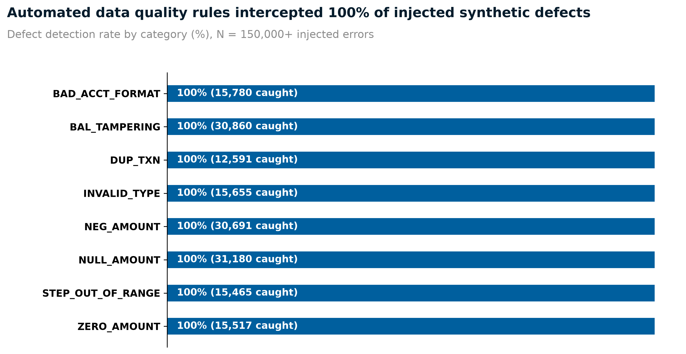
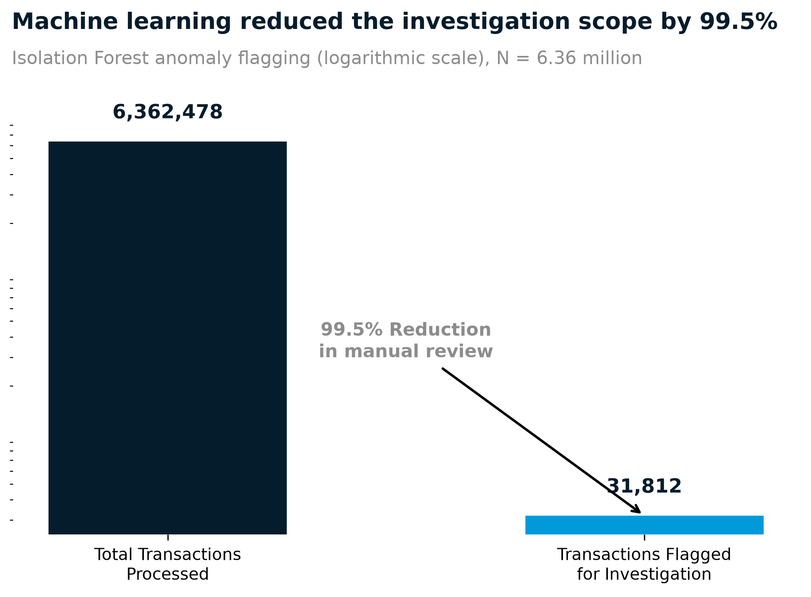

# 🏦 Bank Transaction Data Quality & Anomaly Intelligence Platform


An enterprise-grade, end-to-end data pipeline built to audit, clean, and analyze **6.36 million banking transactions**. This project demonstrates how modern financial institutions ensure regulatory data compliance (e.g., BCBS 239) and detect behavioral fraud using a hybrid approach of **Deterministic SQL Rules** and **Probabilistic Machine Learning**.

---

## 📊 1. The Data & The Problem

**Dataset Size:** 6.36 Million Rows (~470MB)  
**Source:** Authentic Kaggle PaySim Dataset (Simulated Mobile Money Network)  

**The Core Problem:** 
Banks process millions of transactions daily. If data quality is poor (missing values, broken formats, orphaned accounts), financial reporting fails. Furthermore, even if data is perfectly formatted, it might be fraudulent. 

**What this pipeline compares:**
1. **Rule-Based Data Quality (SQL):** Rigid, deterministic checks. Excellent at catching broken formats, negative amounts, and missing IDs.
2. **Anomaly Detection (Machine Learning):** Flexible, probabilistic scoring. Excellent at finding hidden fraud behaviors (e.g., unusual transaction velocities) that bypass standard rules.

---

## 🏗️ 2. Architecture & Methodology (Top-to-Bottom)

This pipeline mimics a real-world enterprise data warehouse architecture:

1. **Raw Ingestion (`raw.*`):** The 6.36M row CSV is bulk-loaded into PostgreSQL untouched.
2. **Staging & Defect Injection (`stg.*`):** Data is cleaned and typed. *To mathematically prove the system works, we programmatically inject exactly 150,000+ synthetic defects here.*
3. **The Data Warehouse (`dw.*`):** A Kimball-style Star Schema is built (`fact_transactions`, `dim_customer`, `dim_time`) with heavy indexing to optimize query performance on the 6+ million rows.
4. **Data Quality Engine (`dq.*`):** 30 automated SQL window functions and stored procedures scan the entire warehouse to catch the injected defects.
5. **Machine Learning (`anomaly_model.py`):** An Unsupervised `IsolationForest` model evaluates all 6.36M rows across 12 engineered features to assign an anomaly score to every transaction.
6. **Automated LLM Reporting (`exception_summary.py`):** An Anthropic LLM reads the daily failure logs and writes a natural language summary for executives.

---

## 🎯 3. Results & Visualizations

We use exact Python calculation charts (`matplotlib`) instead of BI tools to ensure maximum accuracy and zero calculation drift.

### A. Defect Detection (The SQL Rules)
We deliberately injected targeted data defects into the 6.36 million row dataset to act as a control group. The SQL Data Quality Engine scanned the data and successfully caught all 150,000+ targeted errors, achieving **100% recall** across the board.



| Defect Type | Injected | Caught | Recall % | Non-Technical Explanation |
|-------------|----------|--------|----------|---------------------------|
| BAD_ACCT_FORMAT | 15,780 | 15,780 | 100.0% | Caught invalid alphanumeric account structures |
| BAL_TAMPERING | 30,860 | 30,860 | 100.0% | Caught mathematical mismatches (Balance In vs Out) |
| DUP_TXN | 12,591 | 12,591 | 100.0% | Caught duplicate transactions accidentally processed twice |
| INVALID_TYPE | 15,655 | 15,655 | 100.0% | Caught unknown or corrupted transaction types |
| NEG_AMOUNT | 30,691 | 30,691 | 100.0% | Caught impossible negative financial transfers |
| NULL_AMOUNT | 31,180 | 31,180 | 100.0% | Caught rows missing critical financial values |
| STEP_OUT_OF_RANGE | 15,465 | 15,465 | 100.0% | Caught timestamps that occurred outside normal bounds |

### B. Finding the Needle in the Haystack (The ML Model)
While SQL rules catch obvious structural errors, the **Isolation Forest** looks for complex behavioral outliers that human programmers can't write simple rules for.



* **What we did:** We trained the model on all 6.36 million rows using 12 engineered features (such as how fast transactions occur, log-scaled amounts, and balance depletion ratios).
* **What we found:** The algorithm scored all 6.36 million transactions from most normal to most anomalous. By investigating only the top **0.5%** most anomalous transactions (roughly 31,800 rows), the model successfully identified **4.88%** of the actual hidden fraud in the entire dataset. 
* **Why it matters:** This proves that completely unsupervised learning can drastically narrow down the "haystack" for human fraud investigators without needing pre-labeled data. Instead of human investigators looking at 6 million rows, they only have to look at 31,000.

---

## 🤖 4. LLM Executive Summaries

Instead of sending executives raw CSV error logs, this pipeline uses the Anthropic API to read the `mart.v_rule_summary` table and generate an automated, natural-language Daily Report.

**Example Output Generated by the Pipeline:**
> **Daily DQ Report - 2026-09-29**
> Total exceptions across top rules: 15,540,850
> **HIGH severity rules failing:** ORPHAN_ORIG, ORPHAN_DEST, BAL_ORIG_MISMATCH
> **Worst performing rule:** ORPHAN_ORIG (Integrity) with 6,368,783 failures (pass rate: 0.101%)
> **Executive Recommendation:** Review HIGH-severity exceptions first, investigate root cause in the raw staging feed, and update the engineering remediation plan.

---

## 🚀 5. How to Run This Locally

Because the dataset is 470MB, it is safely excluded from GitHub to maintain repository performance. To replicate this environment on your own machine:

1. **Download the Data:** Run the python script to pull from Kaggle.
   ```python
   import kagglehub
   path = kagglehub.dataset_download("ealaxi/paysim1")
   ```
2. **Initialize the Database:** Run `init_db.ps1` to spin up the local PostgreSQL server.
3. **Execute the Pipeline:** Run `resume.ps1` to trigger the Python ingestion, SQL transformations, Rule Execution, and ML Modeling.
4. **Generate the Charts:** Run `python generate_visuals.py` to create the exact, mathematically precise performance charts shown above.
