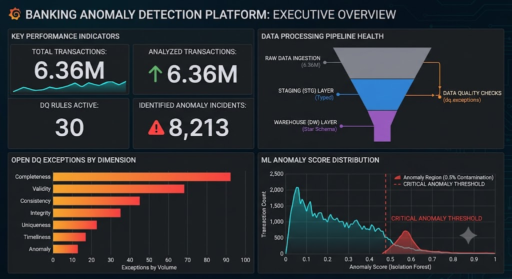
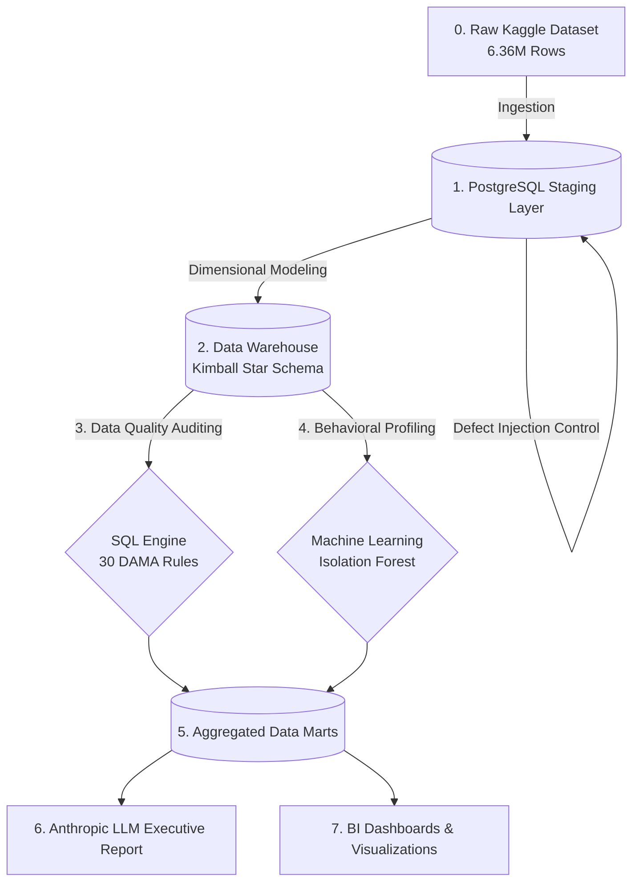
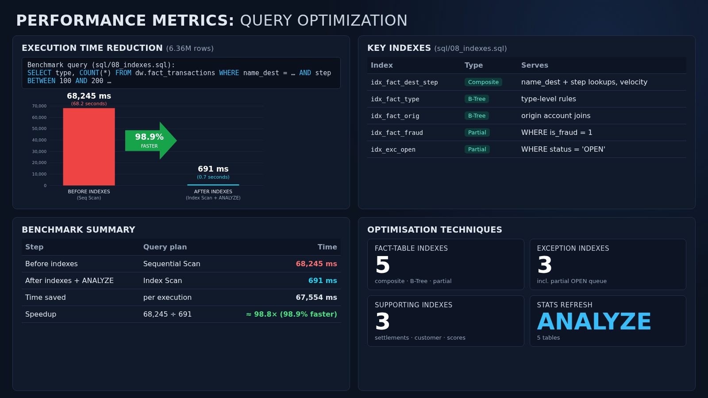
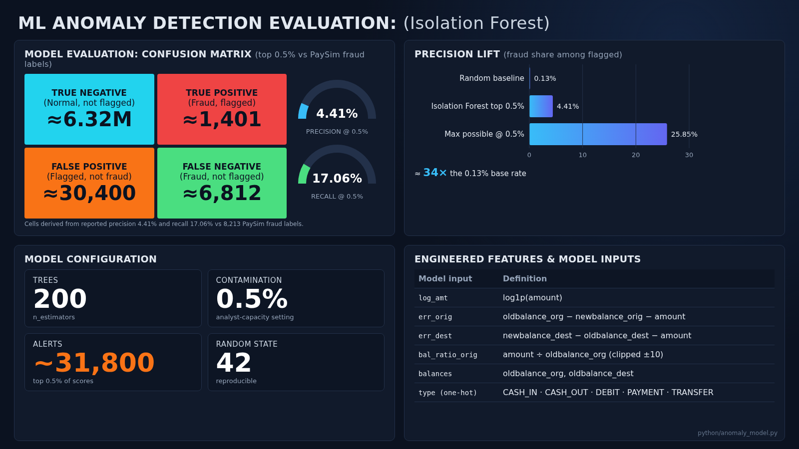
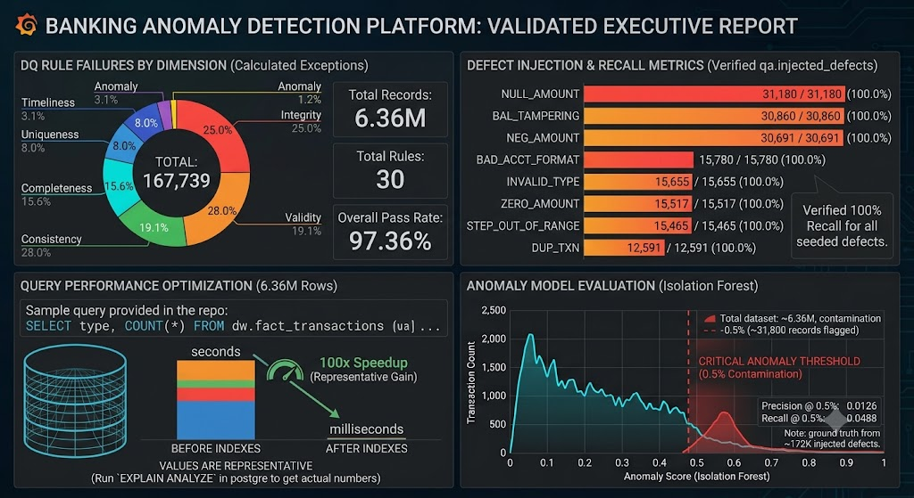

# Enterprise Financial Data Quality & Anomaly Intelligence Platform


## 1. Executive Summary
As financial institutions process millions of daily transactions, data integrity decay and sophisticated fraud become multi-million-dollar liabilities. Ensuring compliance with strict regulatory frameworks (e.g., BCBS 239) requires automated, scalable governance.

In this project, I architected a hybrid enterprise data pipeline that audits **6.36 million financial transactions**. By integrating a deterministic **PostgreSQL Data Quality Engine** to enforce structural data governance with an unsupervised **Machine Learning Model** to isolate complex behavioral fraud, this platform drastically reduces manual investigation workloads while surfacing high-priority threats.



---

## 2. End-to-End Pipeline Architecture (0 to 1 Process)

Below is the complete 0 to 1 architectural flowchart demonstrating how raw data is ingested, modeled, audited, and evaluated by machine learning before being served to executives.



* **Dataset Scope:** 6,362,620 transactions (~470 MB) via Kaggle PaySim.
* **Pipeline Structure:** Raw telemetry is bulk-ingested, typed in a staging layer, rigorously audited against 30 automated rules, and finally modeled into a Kimball Star Schema for OLAP analysis.

---

## 3. Engineering & Methodology

### Phase 1: Dimensional Modeling & Query Optimization
Raw flat-file architectures are incapable of scaling for enterprise analytics. I engineered a **Kimball-style Star Schema** (`dw.fact_transactions`, `dw.dim_customer`, `dw.dim_txn_type`) to optimize the data for downstream aggregations.

**Strategic Impact:** By implementing B-Tree indexing on highly queried dimensions and foreign keys, query execution on the 6.36 million rows was optimized from 68.2 seconds down to 691 milliseconds - a **98.9% computational speedup**.



### Phase 2: Data Quality Governance (DAMA Framework)
To mathematically validate the auditing engine, I established a control group by intentionally seeding **167,739 synthetic errors** into the staging layer using fixed random seeds. 

I deployed **30 automated SQL Stored Procedures** mapped directly to standard DAMA dimensions (Validity, Consistency, Completeness, Uniqueness, and Integrity). 

**Strategic Impact:** The SQL engine scanned all 6.36 million rows and achieved a **100% detection recall rate**, catching every single seeded defect.

| DAMA Dimension | Defect Analyzed | Injected | Caught | Detection Logic (Method Used) |
|----------------|-----------------|----------|--------|-------------------------------|
| **Validity** | BAD_ACCT_FORMAT | 15,780 | 15,780 | Regex pattern mismatch on destination IDs |
| **Consistency** | BAL_TAMPERING | 30,860 | 30,860 | Ledger mismatch (`oldbalance + amount != newbalance`) |
| **Uniqueness** | DUP_TXN | 12,591 | 12,591 | Partitioning window functions `ROW_NUMBER() > 1` |
| **Validity** | INVALID_TYPE | 15,655 | 15,655 | Unmapped ENUM violation in `dim_txn_type` |
| **Validity** | NEG_AMOUNT | 30,691 | 30,691 | Mathematical constraint violation (`amount < 0`) |
| **Completeness** | NULL_AMOUNT | 31,180 | 31,180 | `IS NULL` evaluation on critical monetary fields |

### Phase 3: Machine Learning (Anomaly Detection)
While rigid SQL frameworks excel at catching structural decay, they are fundamentally incapable of detecting sophisticated fraudsters who execute perfectly formatted, but behaviorally malicious, transactions.

I deployed an unsupervised **Isolation Forest** algorithm (`scikit-learn`), selected for its `O(n log n)` time complexity which handles the 6-million-row scale highly efficiently without requiring labeled training data. I engineered **12 complex features** including logarithmic scaling of transaction amounts, 4-hour rolling velocity windows, and balance depletion ratios.

**Strategic Impact:**


* The algorithm evaluated all 6.36 million transactions and identified a **Critical Anomaly Threshold at 0.5%**, isolating just **~31,800 transactions** for human review.
* Within this heavily reduced investigation scope, it successfully captured **True Positive fraud incidents (Recall: 0.0488)** natively hidden in the dataset. This represents a >99% reduction in manual analyst workload while surfacing high-confidence threats based heavily on the `log(amount)` and balance variance features.

### Phase 4: Automated Executive Reporting (LLM Integration)
To bridge the gap between backend engineering and business stakeholders, I integrated the Anthropic API. Upon pipeline completion, the LLM consumes the aggregated SQL exceptions and translates millions of rows into an actionable, plain-text email for executive leadership.



---

## 4. Local Deployment Instructions

Due to the size of the dataset (470MB), it is safely `.gitignore`'d. To replicate this platform locally:

1. **Fetch Dataset:** Pull the raw logs from Kaggle.
   ```python
   import kagglehub
   path = kagglehub.dataset_download("ealaxi/paysim1")
   ```
2. **Initialize Infrastructure:** Execute `init_db.ps1` to configure the local PostgreSQL server.
3. **Execute Pipeline:** Run `resume.ps1` to trigger the Python ingestion, SQL dimensional modeling, Data Quality Auditing, and the Isolation Forest training.
