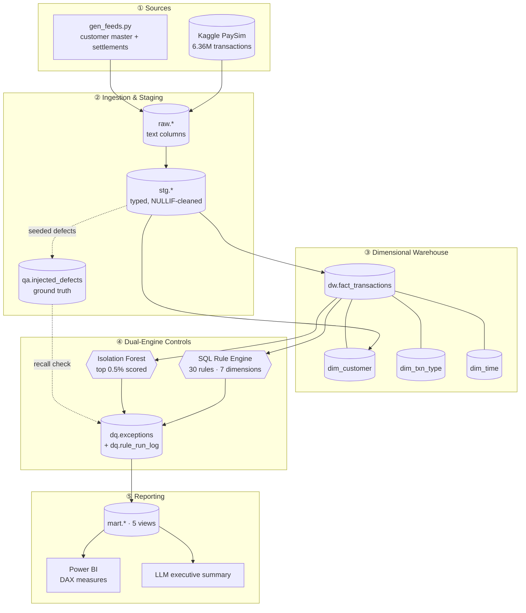
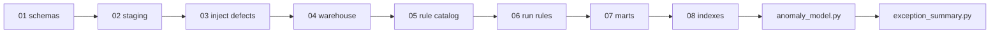
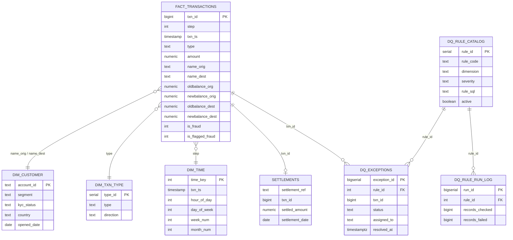
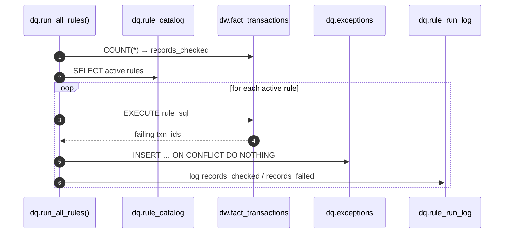
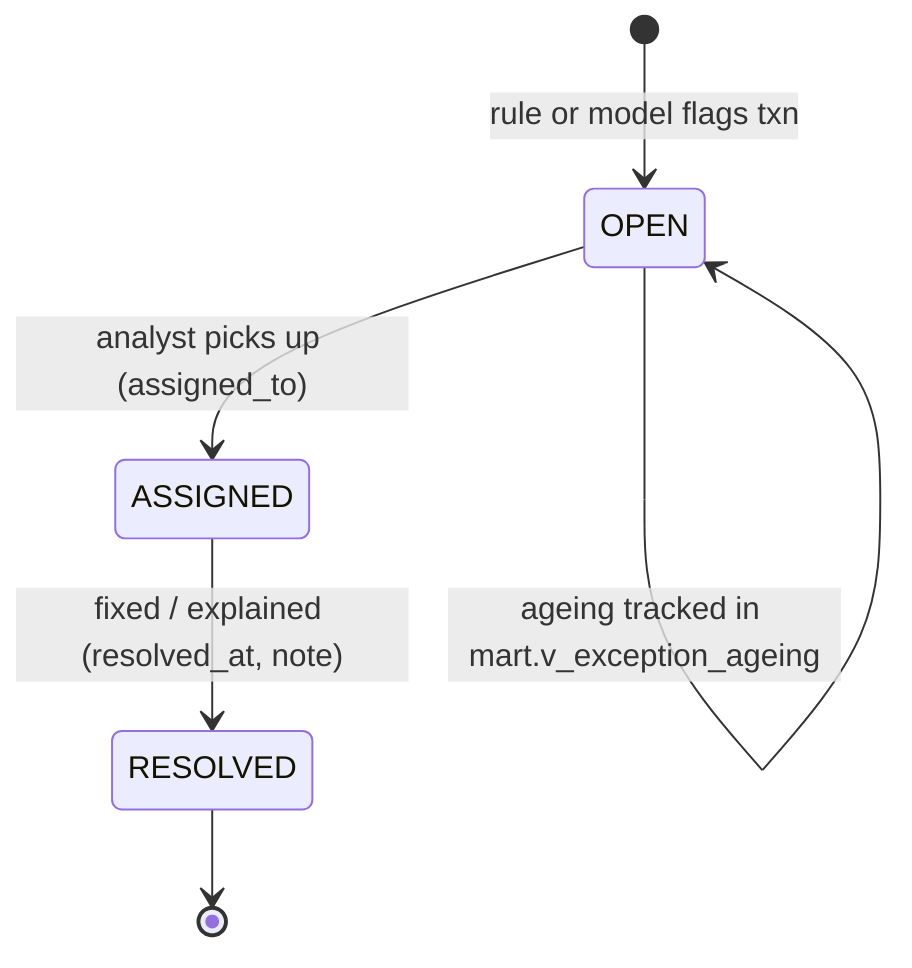
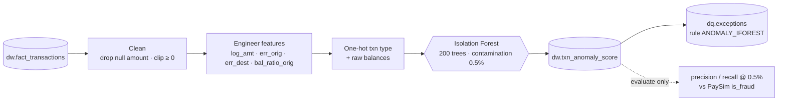
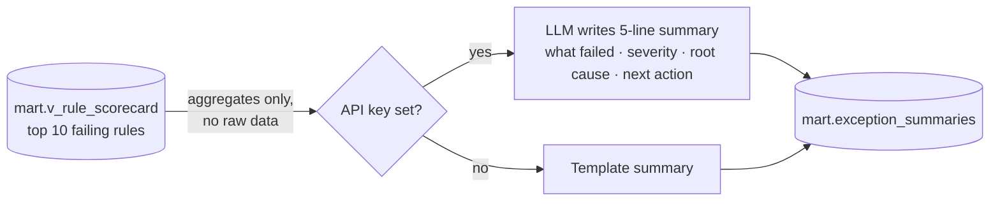

<div align="center">

# 🏦 Bank Transaction Data Quality & Anomaly Detection Platform

**A hybrid SQL + Machine Learning control platform that audits 6.36 million bank transactions for structural defects and behavioural anomalies.**


**6.36M** transactions · **30** DQ rules · **7** dimensions · **98.9%** faster queries · **~34×** fraud lift

</div>

---

## 📑 Table of Contents
1. [Executive Summary](#1-executive-summary)
2. [Business Problem](#2-business-problem)
3. [Key Results](#3-key-results)
4. [Solution Architecture](#4-solution-architecture)
5. [Data Model (Star Schema)](#5-data-model-star-schema)
6. [Data Quality Rule Engine](#6-data-quality-rule-engine)
7. [Exception Lifecycle](#7-exception-lifecycle)
8. [Validation: Detection Recall](#8-validation-detection-recall)
9. [Query Optimisation](#9-query-optimisation)
10. [Anomaly Detection (Isolation Forest)](#10-anomaly-detection-isolation-forest)
11. [Reporting Layer: Data Marts, Power BI & LLM Summary](#11-reporting-layer-data-marts-power-bi--llm-summary)
12. [Testing & CI/CD](#12-testing--cicd)
13. [Tech Stack](#13-tech-stack)
14. [How to Run](#14-how-to-run)
15. [Repository Structure](#15-repository-structure)
16. [Control Dashboards](#16-control-dashboards)

---

## 1. Executive Summary
This project builds an end-to-end **data operations** pipeline:
1. It loads **6,362,620** PaySim bank transactions into a **PostgreSQL star schema**.
2. A catalog-driven engine of **30 SQL data quality rules** validates every transaction.
3. An unsupervised **Isolation Forest** model scores behavioural outliers.
4. Both feed one **exception queue**, which powers control-ready **data marts**, **Power BI DAX measures** and an **LLM-written executive summary** for non-technical stakeholders.

The design follows one principle: **SQL computes every number, ML ranks risk, and the LLM only narrates.**

## 2. Business Problem

| Challenge | Impact if untreated | How this platform handles it |
| :--- | :--- | :--- |
| **Structural data defects** (nulls, invalid formats, broken balances, duplicates) | Corrupts downstream BI and regulatory reporting, and breaches **BCBS 239** data-quality principles | Deterministic SQL rule engine across 7 data quality dimensions |
| **Behavioural anomalies** (well-formed but unusual transactions) | Bypass rule-based checks entirely | Unsupervised Isolation Forest scoring |
| **Alert overload** | Analysts can't review millions of rows | Severity-ranked exception queue, with ML alerts capped at the top 0.5% |
| **Opaque reporting** | Managers can't act on technical output | Data marts, Power BI measures and a plain-language LLM summary |

## 3. Key Results

| Metric | Result |
| :--- | :--- |
| 📦 Transactions processed | **6,362,620** (~470 MB) |
| 🧪 Data quality rules | **30** across **7** dimensions |
| 🎯 Seeded defects (ground truth) | **155,148** across 7 defect types |
| ✅ Rule detection | **100% recall** on every seeded defect type (155,148 / 155,148) |
| ⚡ Query optimisation | **68.2 s → 691 ms (98.9% faster)** |
| 🔎 ML alert volume | Top **0.5%** of scores, about **31,800** alerts |
| 📈 ML lift | **17.06%** of labelled fraud captured at **4.41% precision**, about **34×** the 0.13% base rate |
| 🧷 Automated tests | **10** pytest tests in **GitHub Actions** on PostgreSQL 16 |


---

## 4. Solution Architecture



### Pipeline execution order



## 5. Data Model (Star Schema)



## 6. Data Quality Rule Engine

The engine is **metadata-driven**. Each rule is a row in `dq.rule_catalog` (code, dimension, severity, SQL), so you add a check by inserting a row, with no code changes.



| Dimension | # | Rules |
| :--- | :---: | :--- |
| **Completeness** | 5 | `NULL_AMOUNT` · `NULL_TYPE` · `NULL_ORIG_ACCT` · `NULL_DEST_ACCT` · `NULL_BALANCE_FIELDS` |
| **Validity** | 6 | `NEG_AMOUNT` · `ZERO_AMOUNT` · `INVALID_TYPE` · `AMOUNT_OVER_LIMIT` · `BAD_ACCT_FORMAT` · `STEP_OUT_OF_RANGE` |
| **Consistency** | 7 | `BAL_ORIG_MISMATCH` · `BAL_DEST_MISMATCH` · `ORIG_NEG_BALANCE` · `DEST_NEG_BALANCE` · `FLAG_RULE_MISMATCH` · `SELF_TRANSFER` · `PAYMENT_DEST_NOT_MERCHANT` |
| **Uniqueness** | 3 | `DUP_BUSINESS_KEY` · `DUP_CUSTOMER_MASTER` · `DUP_SETTLEMENT_REF` |
| **Integrity** | 4 | `ORPHAN_ORIG` · `ORPHAN_DEST` · `SETTLEMENT_MISSING` · `SETTLEMENT_AMOUNT_DIFF` |
| **Timeliness** | 2 | `LATE_SETTLEMENT` (beyond T+2) · `FUTURE_DATED` |
| **Anomaly** | 3 | `AMOUNT_ZSCORE_BY_TYPE` (more than 4σ by type) · `DEST_VELOCITY` (more than 10 txns in a 4-hour window) · `ANOMALY_IFOREST` (ML) |
| **Total** | **30** | |

**Sample rules**

```sql
-- Consistency: origin balance must reconcile with the transaction amount
SELECT txn_id FROM dw.fact_transactions
WHERE amount IS NOT NULL
  AND ABS(newbalance_orig - CASE WHEN type = 'CASH_IN' THEN oldbalance_org + amount
                                 ELSE oldbalance_org - amount END) > 0.01;

-- Anomaly: destination velocity via a window function (step = 1 hour)
SELECT txn_id FROM (
    SELECT txn_id,
           COUNT(*) OVER (PARTITION BY name_dest ORDER BY step
                          RANGE BETWEEN 3 PRECEDING AND CURRENT ROW) AS c
    FROM dw.fact_transactions) t
WHERE c > 10;
```

## 7. Exception Lifecycle

Every failure becomes a tracked work item with a status, owner and resolution fields, which supports issue follow-up, not just detection. (The schema stores `status`, `assigned_to`, `resolved_at` and `note`; the workflow below shows the intended use.)



> `dq.exceptions` enforces `UNIQUE (rule_id, txn_id)`, so re-runs are **idempotent** and never double-count.

## 8. Validation: Detection Recall

To measure detection objectively, the pipeline injects **seeded defects** (`setseed(0.42)`) into staging and logs each one in `qa.injected_defects` as ground truth. It then joins that table to `dq.exceptions`.

| Defect type | Injected | Caught | Recall |
| :--- | ---: | ---: | ---: |
| NULL_AMOUNT | 31,180 | 31,180 | 🟢 100.0% |
| BAL_TAMPERING | 30,860 | 30,860 | 🟢 100.0% |
| NEG_AMOUNT | 30,691 | 30,691 | 🟢 100.0% |
| BAD_ACCT_FORMAT | 15,780 | 15,780 | 🟢 100.0% |
| INVALID_TYPE | 15,655 | 15,655 | 🟢 100.0% |
| ZERO_AMOUNT | 15,517 | 15,517 | 🟢 100.0% |
| STEP_OUT_OF_RANGE | 15,465 | 15,465 | 🟢 100.0% |
| **Total** | **155,148** | **155,148** | **🟢 100.0%** |

*Source: [`docs/recall_results.txt`](docs/recall_results.txt).*

## 9. Query Optimisation

Rules scan 6.36M rows repeatedly, so indexing is designed around the actual access patterns.

| Index | Type | Serves |
| :--- | :--- | :--- |
| `idx_fact_dest_step (name_dest, step)` | Composite B-Tree | Velocity windows, destination lookups |
| `idx_fact_orig (name_orig)` | B-Tree | Orphan and duplicate checks |
| `idx_fact_type (type)` | B-Tree | Type-level validity and z-score rules |
| `idx_fact_fraud … WHERE is_fraud = 1` | **Partial** | Fraud evaluation |
| `idx_exc_open … WHERE status = 'OPEN'` | **Partial** | Open-exception queue |
| `idx_exc_txn`, `idx_anomaly_txn`, `idx_stg_settlements_txn` | B-Tree | Exception, ML and settlement joins |

Planner statistics are refreshed with `ANALYZE`.

| | Plan | Time |
| :--- | :--- | ---: |
| Before | Sequential scan | **68,245 ms** |
| After | Index scan | **691 ms** |
| **Improvement** | | **98.9% faster** |


## 10. Anomaly Detection (Isolation Forest)



| Feature | Formula | Why it matters |
| :--- | :--- | :--- |
| `log_amt` | `log1p(amount)` | Tames heavy-tailed amounts |
| `err_orig` | `oldbalance_org − newbalance_orig − amount` | Origin balance residual |
| `err_dest` | `newbalance_dest − oldbalance_dest − amount` | Destination balance residual |
| `bal_ratio_orig` | `amount / oldbalance_org` (clipped ±10) | Share of balance moved |

```python
model = IsolationForest(n_estimators=200, contamination=0.005, random_state=42, n_jobs=-1)
model.fit(X)
df["score"] = -model.score_samples(X)          # higher = more anomalous
```

| Metric @ top 0.5% | Value |
| :--- | ---: |
| Alerts | ~31,800 |
| Precision | 4.41% |
| Recall of labelled fraud | 17.06% |
| Lift vs 0.13% base rate | ~34× |

> **Read honestly:** the model is **unsupervised**, and labels are used only for evaluation. The 0.5% cut-off is an analyst-capacity setting, not a finding. Given how few fraud cases there are, the maximum possible precision at this cut-off is about 26%.


## 11. Reporting Layer: Data Marts, Power BI & LLM Summary

| Mart view | Purpose |
| :--- | :--- |
| `mart.v_rule_scorecard` | Pass rate and failures per rule per run |
| `mart.v_exception_ageing` | Open exceptions by age and severity |
| `mart.v_daily_control_report` | Daily control KPIs and SLA status |
| `mart.v_exception_detail` | Transaction-level drill-through |
| `mart.v_anomaly_overview` | ML score distribution by type |

**Power BI** connects only to `mart.*` views, never to the 6M-row fact table. The 4-page design spec and DAX measures are in [`powerbi/README.md`](powerbi/README.md):

```dax
Pass Rate % = 1 - DIVIDE(SUM(v_rule_scorecard[records_failed]), SUM(v_rule_scorecard[records_checked]))
Open HIGH   = CALCULATE(SUM(v_exception_ageing[open_exceptions]), v_exception_ageing[severity] = "HIGH")
```

**LLM executive summary** (`python/exception_summary.py`):




## 12. Testing & CI/CD

**10 pytest tests** check that each rule flags a crafted bad row and leaves a clean row alone:

`null_amount` · `neg_amount` · `zero_amount` · `invalid_type` · `bad_acct_format` · `self_transfer` · `payment_dest_not_merchant` · `dup_business_key` · `clean_row_not_flagged` · `rule_run_log_populated`

**GitHub Actions** (`.github/workflows/ci.yml`) runs the suite against a **PostgreSQL 16** service container on every push and PR to `main`, and weekly on Mondays.

## 13. Tech Stack

| Layer | Tools |
| :--- | :--- |
| Database & warehouse | PostgreSQL 16, SQL (CTEs, window functions, PL/pgSQL procedures, partial indexes) |
| Data processing | Python, pandas, NumPy, SQLAlchemy, psycopg2 |
| Machine learning | scikit-learn (Isolation Forest) |
| Reporting | SQL mart views, Power BI (DAX) |
| AI | Anthropic Claude API (narration only) |
| Quality & DevOps | pytest, GitHub Actions |

## 14. How to Run

```bash
# 1. Install dependencies
pip install -r requirements.txt

# 2. Download PaySim (~470 MB, git-ignored)
python download_data.py

# 3. Run the full pipeline (schemas → staging → defects → warehouse → rules → marts → indexes)
python python/run_pipeline.py          # Windows: double-click RUN_PIPELINE.bat

# 4. Score anomalies
python python/anomaly_model.py

# 5. (Optional) LLM summary
export ANTHROPIC_API_KEY=...           # falls back to a template if unset
python python/exception_summary.py

# 6. Tests
pytest tests/
```

Set `DATABASE_URL` to point at your PostgreSQL instance. The default is `postgresql+psycopg2://postgres:pw@localhost:5432/bankdq`.

## 15. Repository Structure

```
├── sql/
│   ├── 01_schemas.sql          # raw, stg, dw, dq, qa, mart
│   ├── 02_staging.sql          # typed staging tables
│   ├── 03_inject_defects.sql   # seeded ground-truth defects
│   ├── 04_warehouse.sql        # fact + 3 dimensions
│   ├── 05_rule_catalog.sql     # 30 rules, exceptions, run log
│   ├── 06_run_rules.sql        # dq.run_all_rules() + recall query
│   ├── 07_marts.sql            # 5 reporting views
│   └── 08_indexes.sql          # performance indexes + ANALYZE
├── python/
│   ├── run_pipeline.py         # orchestrator
│   ├── gen_feeds.py            # synthetic customer master & settlements
│   ├── anomaly_model.py        # Isolation Forest
│   └── exception_summary.py    # LLM / template summary
├── tests/                      # pytest rule tests
├── powerbi/README.md           # connection guide + DAX
├── docs/recall_results.txt     # detection recall evidence
├── assets/                     # control dashboards (PNG)
├── .github/workflows/ci.yml    # CI pipeline
├── download_data.py
├── RUN_PIPELINE.bat
└── requirements.txt
```

## 16. Control Dashboards

Every figure on these boards comes from the repository: `docs/recall_results.txt`, `sql/05_rule_catalog.sql`, `sql/08_indexes.sql` and the `python/anomaly_model.py` evaluation output.

| Dashboard | What it shows |
| :--- | :--- |
| **Executive Overview** | Volume, rule and dimension KPIs, pipeline layers, rules by dimension, ML alert funnel |
| **Performance Metrics** | 68,245 ms → 691 ms benchmark, key indexes, speedup summary |
| **ML Evaluation** | Confusion matrix at the top 0.5%, precision/recall gauges, lift, model config, features |
| **Validated Executive Report** | 155,148 seeded defects by type, 100% recall per type, query and model KPIs |


---

<div align="center">

**SQL computes every number · ML ranks risk · the LLM only narrates**

</div>
