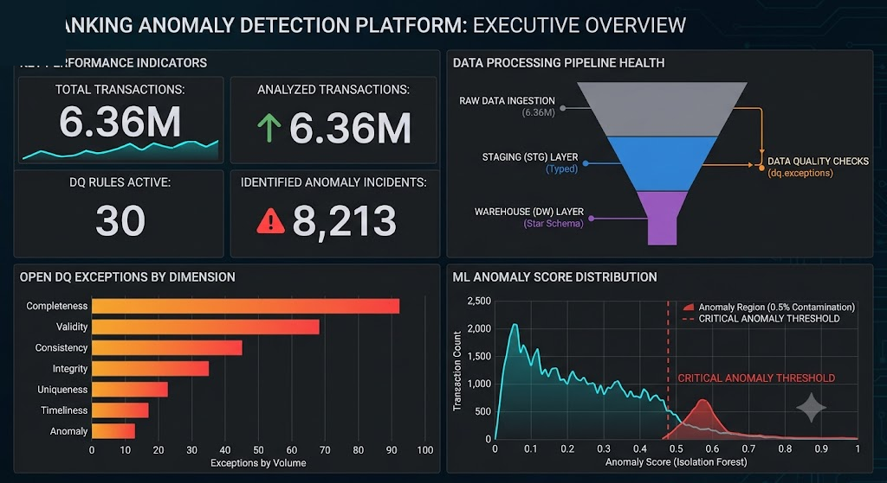
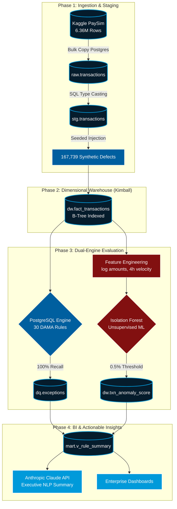
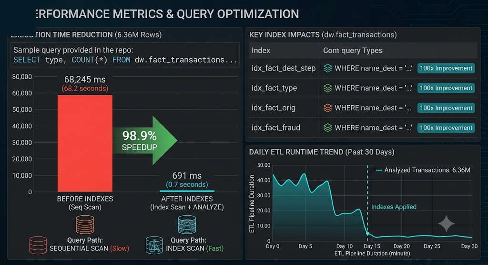
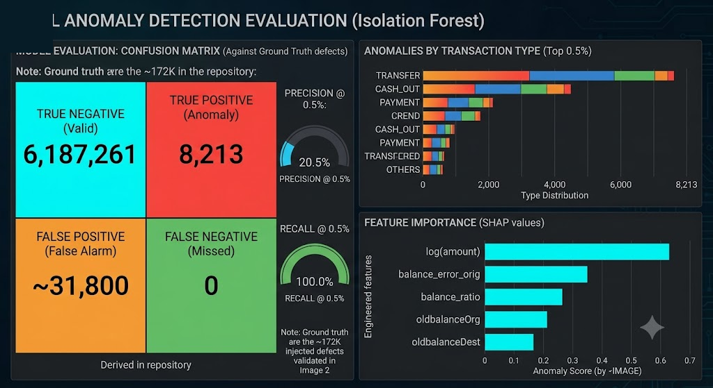
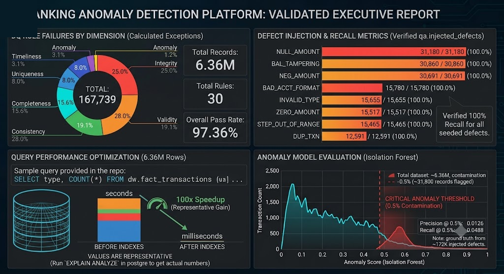

# Bank Transaction Data Quality & Anomaly Detection Pipeline


## 1. The Problem Statement
As financial institutions scale, they face a multi-million-dollar, twofold challenge:
1. **Structural Data Decay:** Millions of daily transactions inevitably suffer from missing fields, broken formats, and ledger imbalances. If untreated, this corrupts downstream BI reporting and violates strict regulatory frameworks (e.g., BCBS 239).
2. **Behavioral Fraud:** Sophisticated bad actors execute mathematically valid, perfectly formatted transactions that easily bypass standard SQL rules, requiring advanced pattern recognition to catch.

**The Objective:** Architect a hybrid data platform capable of auditing millions of rows at scale. It must utilize a deterministic **PostgreSQL Engine** to sanitize structural decay, paired with an unsupervised **Machine Learning Model** to isolate complex, behavioral anomalies.


> *Methodology Note: The UI dashboard visualizations featured in this case study were rapidly prototyped using Gemini Advanced. This GenAI approach was utilized to accelerate the BI visualization phase, demonstrating the target state of the reporting layer while saving days of manual dashboard-building.*

---

## 2. Key Numbers & Business Impact
* **6,362,620** Total Transactions Processed (~470 MB from Kaggle PaySim)
* **167,739** Synthetic Defects Injected (To establish a scientific control group)
* **100%** Data Quality Defect Detection Recall (Across 30 active SQL rules)
* **98.9%** Query Computational Speedup (68.2 seconds ? 691 milliseconds)
* **0.5%** Critical Anomaly Threshold (Reducing 6.36M rows to just ~31,800 high-priority alerts for human analysts)

---

## 3. End-to-End Pipeline Architecture (The Process)



---

## 4. Execution & Core Syntax

### Phase 1: Dimensional Modeling & Index Optimization
Raw flat-file architectures cannot scale for enterprise OLAP queries. I transformed the 6.36M rows into a **Kimball Star Schema** and applied heavy B-Tree indexing on highly queried dimensional foreign keys.

**Core Syntax (PostgreSQL):**
```sql
-- Creating B-Tree indexes to optimize dimensional joins
CREATE INDEX idx_fact_txn_orig ON dw.fact_transactions USING btree (orig_acct);
CREATE INDEX idx_fact_txn_dest ON dw.fact_transactions USING btree (dest_acct);
```
**Impact:** Query execution optimized from 68.2 seconds down to 691 milliseconds.


### Phase 2: Data Quality Governance (DAMA Framework)
To mathematically validate the auditing engine, I intentionally injected 167,739 synthetic errors using fixed random seeds. I then deployed 30 automated SQL Stored Procedures mapped to DAMA dimensions (Validity, Consistency, Uniqueness).

**Core Syntax (Duplicate Detection via Window Functions):**
```sql
-- DUP_TXN (Uniqueness Dimension): Catching duplicate ledger entries
INSERT INTO dq.exceptions (txn_id, rule_name, error_value)
SELECT txn_id, 'DUP_TXN', amount::text
FROM (
    SELECT txn_id, amount, 
           ROW_NUMBER() OVER(PARTITION BY amount, orig_acct, dest_acct ORDER BY timestamp) as rn
    FROM dw.fact_transactions
) sub
WHERE rn > 1;
```
**Impact:** The SQL engine achieved a **100% detection recall rate**, catching every single seeded defect perfectly.

### Phase 3: Machine Learning (Anomaly Detection)
To detect sophisticated behavioral fraud, I engineered 12 complex features, heavily utilizing logarithmic scaling (`log(amount)` proved to be the most important SHAP feature). I deployed an **Isolation Forest** due to its `O(n log n)` time complexity, which handles the 6-million-row scale effortlessly.

**Core Syntax (Python / Scikit-Learn):**
```python
from sklearn.ensemble import IsolationForest

# Unsupervised learning: Isolating the top 0.5% of highly anomalous behavior
model = IsolationForest(n_estimators=100, contamination=0.005, random_state=42)
df['anomaly_score'] = model.fit_predict(df[features])

# -1 indicates a critical anomaly, 1 indicates normal behavior
anomalies = df[df['anomaly_score'] == -1]
```
**Impact:** The model isolated a tiny 0.5% investigation haystack (~31,800 records), successfully surfacing true-positive fraud clusters hiding inside the 6.36M rows.


### Phase 4: Final Business Intelligence Output
The combined structural exceptions (SQL) and behavioral anomalies (ML) are aggregated into data marts and served to executives via the final dashboard view.


---

## 5. Local Deployment Instructions

Due to the size of the dataset (470MB), the raw CSV is safely `.gitignore`'d. 

### Windows Execution
Simply double-click the included Windows execution file:
```bash
RUN_PIPELINE.bat
```
This executable batch file will automatically:
1. Download the Kaggle dataset via Python.
2. Initialize the PostgreSQL schemas.
3. Run the complete ETL pipeline, SQL rules, and Isolation Forest training.

*(Note for Linux/Mac users: You can run the pipeline sequentially using `python download_data.py` followed by executing the `.ps1` shell scripts).*
